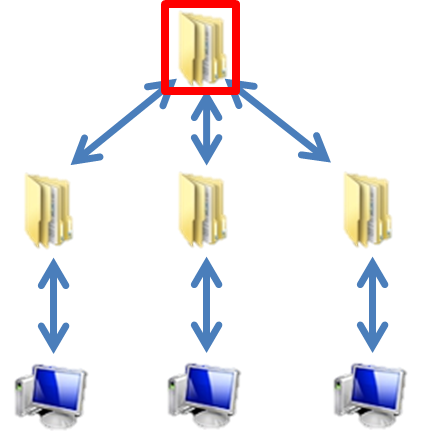
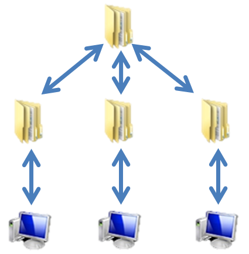

# Git版本控制
<br />
組員：廖祐德、吳珮均、曾永權

-----

## 什麼是 git ?
分散式版本控制系統

 
----

## 為什麼要學 git ?
<div class="fragment">
	ex:[大一專題](https://www.facebook.com/groups/1597697557217011/files/)
</div>

-----

## github又是什麼？

<div class="fragment">
 	<p>GitHub是一個商業網站</p>
</div>

<div class="fragment">
 	<p>GitHub的本體為Git的Server</p>
</div>

</img>

-----

## git 的優點
<div class="fragment">
 	<p>1.免費、開源</p>
	<p>[連Git都是用Git作為版本控管軟體](https://github.com/git/git)</p>
</div>

<div class="fragment">
	 <p>2.檔案小、速度快</p>
	 <p>(只記錄版本間的差異)</p>
</div>
 
 
<div class="fragment">
	 <p>3.分散式系統</p>
</div>

----

## 集中式系統 v.s 分散式系統




----

## git 的缺點
<div class="fragment">
 	<p>1.易學難精 </p>
</div>

<div class="fragment">
 	<p>2.CMD比GUI好用，但容易讓人卻步</p>
</div>

-----

## 如何安裝 git

[安裝網址](https://git-scm.com/download/win)

安裝過程都直接next

----

## 驗證是否成功安裝
找到git bash後開啟
```
$git --version
git version 2.14.1.windows.1
```
出現類似訊息代表成功

-----

## 使用SourceTree作GUI介面

[安裝網址](https://www.sourcetreeapp.com/)

安裝過程一樣直接next

-----

## 指令介紹

----

## 切換目錄 

切換到你想要進行版本控管的目錄下
```
$cd desktop/test
```

----

## 初始化

使該目錄開始進行Git版本控制
```
$git init
```

----

## 如果不想要再給Git控制了？

刪除.git資料夾

<p style="color:red" class="fragment">任何東西都救得回來，但.git被刪了就沒辦法</p>

----

## 顯示目前狀態

顯示未被追蹤、被追蹤的檔案名稱

```
$git status 
```

----

## git 的三個區塊

</img>
</img>

----
## 加入暫存區

把指定的檔案加入暫存區

```
$git add <檔名>
$git add index.html
$git add --all (把所有改變的檔案加入暫存區)
```

----

## 把暫存區裡的檔案存檔

將暫存區的檔案存到儲存庫

" "內輸入文字說明這次改變了甚麼東西

``` 
$git commit -m "<訊息>"
$git commit -m "line 38~52 bug fixed"
```

----

## 分支

```
$git branch <分支名>
$git branch duck
```

----

## 切換分支

```
$git checkout <分支名>
$git checkout duck
```

----

## 合併分支

```
$git merge <分支名>
```

----

#### 兩個分支都改到了同一行程式碼怎麼辦？

<div class="fragment">
	<p>人工處理</p>
</div>

----

## 推上GitHub

把所有Commit都放上GitHub

```
$git push <網址> <分支> (將該分支推向該網址)
$git push https://github.com/ted850914/SE_Present master
```

----

## 將專案下載下來

```
$git clone <網址>
$git clone https://github.com/ted850914/SE_Present
```

-----

## 最後

<div class="fragment">
	<p>1. 恭喜你學會了基本的指令！</p>
</div>
<div class="fragment">
	<p>2. 但Git的功能和指令還有非常非常多...</p>
</div>
<div class="fragment">
	<p>3. 想再了解更多可參考此PPT，後面還有很多內容</a></p>
</div>
<div class="fragment">
	<p>4. 此PPT也是使用Git做[版本控制](https://github.com/ted850914/ted850914.github.io) 並使用GitHub.io快速建立靜態網站</p>
</div>

----

## 分工

曾永權：PPT初版

廖祐德：資料蒐集、PPT二版

吳珮均：PPT內容精簡化

----

## 參考資料

[為你自己學Git](https://gitbook.tw/)

----

# Q&A

-----

# Q&A補充

----

<p>1. 只能把檔案上傳到GitHub上面嗎？</p>

<br />

<p>A: 不是，GitHub只是一個免費讓大家上傳的Server</p>
<p>所以也可以自己架一個Git Server給自己或團隊使用</p>

----

<p>2. Git會把所有檔案都存進去嗎？</p>

<br />

<p style="font-size:30px;">A: Git只有在第一次commit的時候會把所有檔案儲存</p>
<p style="font-size:30px;">之後的commit是會存與上一次的commit之間的差別</p>

<br />

<p style="font-size:30px;">Example: 若上一次commit有1個10000行的程式碼檔案</p>
<p style="font-size:30px;">而你只改了其中1行後再commit，Git只會存你改的那一行</p>
<p style="font-size:30px;">而不是把整個10000行程式碼都儲存在這次的commit中</p>

----

<p>3. 為甚麼推薦使用CMD而不是GUI？</p>

<br />

<p style="font-size:30px;">A: 使用CMD可以知道系統處理的細節</p>
<p style="font-size:30px;">對於觀念的建立很有幫助</p>

<br style="font-size:30px;"/>

<p style="font-size:30px;">若要處理複雜的進階操作，GUI會無法做到</p>

<p style="font-size:30px;">Example: 解決衝突，單一檔案歷史異動追蹤...等</p>

-----

# 額外補充

----

## 顯示紀錄

1. 是誰 commit（人是誰殺的）
1. 什麼時候 commit （什麼時候殺的）
1. commit 時做了什麼事 （怎麼殺的）

git log (--oneline,--graph)

```
$git log --oneline
```

----

## 移除檔案

$git rm (--cached,*.txt)

--cached:只是讓git不再控管這個檔案，並非刪除

*.txt:刪除所有txt檔案

```
$git rm --cached hello.txt
```

----

## 改檔名

git mv
```
$git mv hello.txt world.txt
```

----

## 改commit訊息

```
$git commit --amend -m "restore commit msg"
```

----

## 何時要 commit?

<div class="fragment">
	<p>1. 完成了一個任務</p>
</div>
<div class="fragment">
	<p>2. 工作告一段落(下班、休息)</p>
</div>
<div class="fragment">
	<p>3. 你想要的時候</p>
</div>

----

## commit後面的亂碼？

<div class="fragment">
	<p>類似每個Commit的身分證</p>
</div>

----

## 回復到先前版本

$git reset e12d8ef^:回復到e12d8ef的前一版本

$git reset e12d8ef~3:回復到e12d8ef的前三版本

e12d8ef:每個版本的編號，可用 git log --oneline查看

```
$git reset e12d8ef~3
```

----

## A合併B 跟 B合併A 的差別？

基本上沒什麼差，只是誰在前面的不同
</img>

----

</img>
&nbsp;
</img>
<br />
$git checkout cat &nbsp;&nbsp;&nbsp;&nbsp;&nbsp;&nbsp;&nbsp;&nbsp;&nbsp; $git checkout dog
<br />
$git merge dog &nbsp;&nbsp;&nbsp;&nbsp;&nbsp;&nbsp;&nbsp;&nbsp;&nbsp;&nbsp;&nbsp;&nbsp;&nbsp; $git merge cat

----

想了解更多請看[此網站](https://gitbook.tw/)

