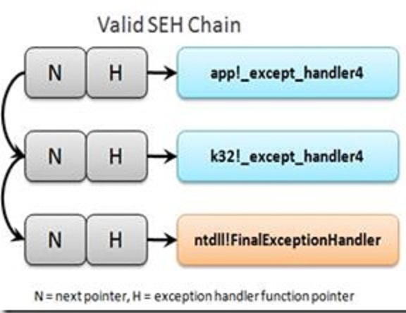
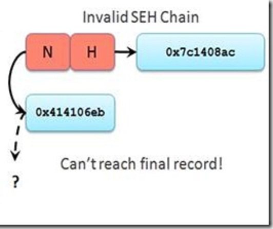
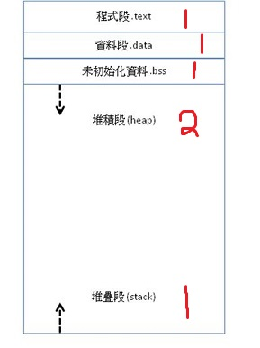
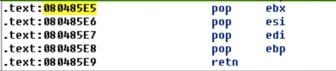
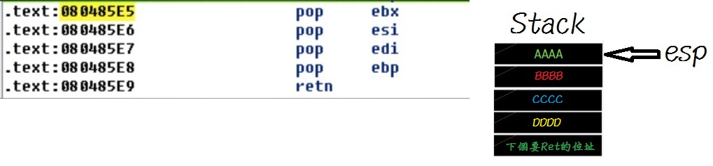
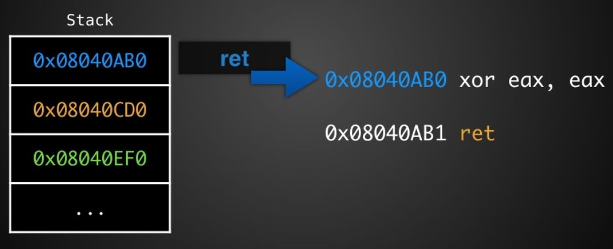
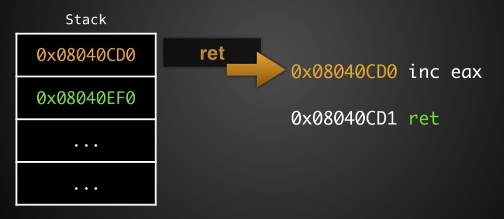
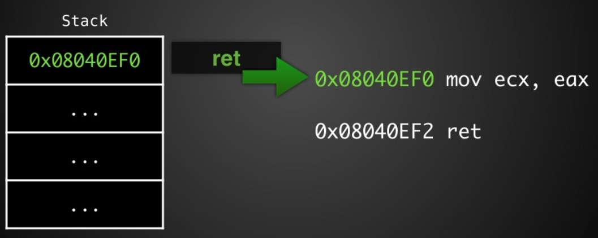
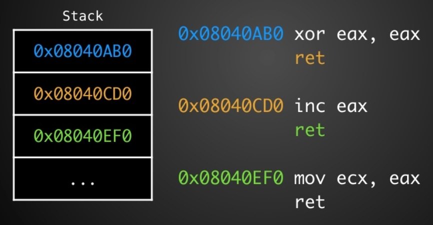

## 資安期末報告-第五組
<br />
組員：廖祐德、吳珮均、李偉強、董晉瑜

主題：Buffer Overflow, Shell Code, and Advanced Protection.

-----

### 介紹內容

W^X

DEP

SEH

ASLR

ROP

-----

### W^X (Write XOR Execute)

----

將資料區段上標示可執行或可寫入

<div class="fragment">
但不會有可執行且可寫入
</div>

<div class="fragment">
write^execute==1
</div>

----

一旦被標為可寫入之後，就再也無法執行該區段

-----

#### DEP (Data Execution Prevention)

資料執行防止

----

將各個資料區段利用W^X的概念保護

防止Buffer Overflow導致Shellcode攻擊

----

可下指令 -fno-stack-protector -z execstack 關閉DEP

----

## DEMO

-----

#### SEH(Structured Exception Handling)

結構化異常處理

----

在Windows作業系統上，處理異常事件(硬體、軟體)

try-except or try-finally

----

### try-except

```
__try 
{
   //受保護執行的程式碼
}
__except ( 過濾函式 )
{
   //異常處理的程式碼
}
```

----

### try-finally

```
__try 
{
   //受保護執行的程式碼
}
__finally
{
   //不管怎樣都會執行
}
```

----

### SEH Chain



----

### SEH Overwrite

利用Buffer Overflow改寫SEH Chain的指標，並執行ShellCode



-----

#### ASLR(Address space layout randomization)

位址空間配置隨機載入

----

可修改/proc/sys/kernel/randomize_va_space

```
echo "0" > /proc/sys/kernel/randomize_va_space

```

----

### 分為3種等級

0 > 完全不隨機

1 > 部分的隨機化

2 > 完全的隨機化

----



----

## DEMO

-----

#### ROP(Return-oriented Programming)

----

#### 目前學到的Buffer Overflow攻擊手法

覆蓋Return位址，執行在Stack上的Shellcode

<div class="fragment">
	若有DEP和ASLR的保護則無法實現
</div>

----

Ret至包含Ret的程式碼區塊上



----

如果現在Stack長這樣



```
ebx=AAAA
esi=BBBB
edi=CCCC
ebp=DDDD
ret到下個地址
```

----



----



----



----



<div class="fragment">
	等同於mov ecx, 1
</div>

----

每塊程式區段稱為Gadget

<div class="fragment">
可以不斷Return，找尋有用的GadGet，就可以自由操控暫存器
</div>

<div class="fragment">
需求：程式要夠大
</div>

----

## Demo前準備1

```
//目標 執行Shell
#include <stdio.h>
void bof()
{
    char buf[100];
    puts("/bin/sh");
    gets(buf);
    return;
}
int main(int argc, const char *argv[])
{
    bof();
    return 0;
}
```

<div class="fragment">
編譯時加上-static，將stdio.h內的程式碼放進text區塊中，以便進行ROP攻擊
</div>

----

## Demo前準備2

ROPgadget

可以找尋程式內所有的Gadget

----

## Demo前準備3

[Syscall Table](https://syscalls.kernelgrok.com/)

----

## Demo

-----

# Q&A
