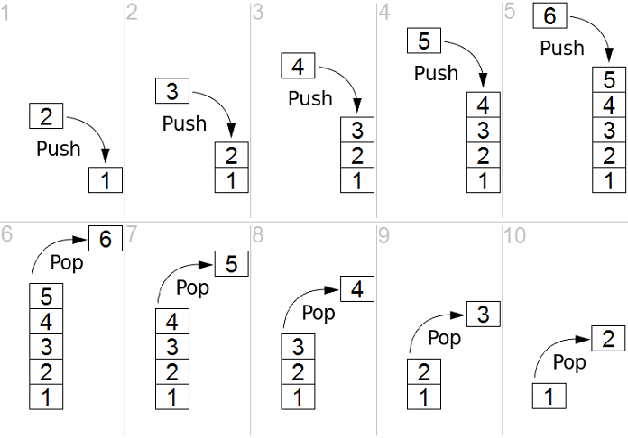
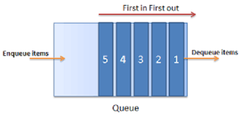
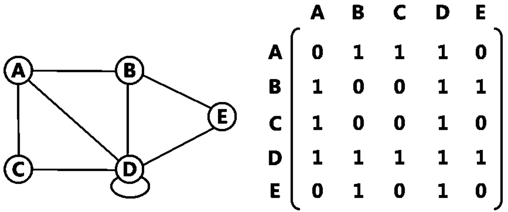
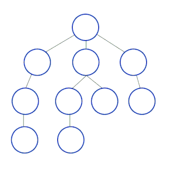
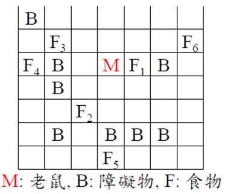
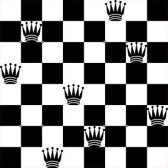

### 競程讀書會Week2
## DFS & BFS

-----

## 前情提要-資料結構

Stack

Queue

-----

## Stack

像是疊盤子，先進後出



----

## STL

Example：
```
#include<stack>
stack<int> s;
s.push(1);		//把1推進stack中
s.push(2);		//把2推進stack中
s.top();		//回傳stack頂端的值
s.pop();		//移除stack頂端的值 它不會回傳任何東西!!
```

----

## 小細節

在使用s.top()前一定要先確認s.empty()==false

不然會整組壞掉

----

想了解更多請上http://www.cplusplus.com/reference/stack/stack/

-----

## Queue

像是排隊，先進先出



----

## STL
```
#include<queue>
queue<int> q;
q.push(1);		//把1推進queue中
q.push(2);		//把2推進queue中
q.front();		//回傳queue最前面的值
q.back();		//回傳queue最後面的值
q.pop();		//移除queue最前面的值 它不會回傳任何東西!!
```

----

## 小細節

在使用q.front()和q.back()前一定要先確認q.empty()==false

不然會WA(不會整組壞掉)

----

想了解更多請上http://www.cplusplus.com/reference/queue/queue/

----

## Q&A

-----

## DFS Depth-First Search

深度優先搜尋演算法


<div class="fragment">
	以stack當資料結構基底，可以利用遞迴實作
</div>

----

程式碼大概會長這樣：

```
void dfs(Node x){
	if(x==空的){
		return;
	}
	dfs(x.left);
	dfs(x.mid);
	dfs(x.right);
}
```

----

如果今天題目是：
給一張無向圖有n個點，設定兩個點S、T，用DFS判斷S是否能走到T


----

程式碼大概會長這樣：
```
void dfs(int x){
	if(x==終點){
		//設定ans==true
		return;
	}
	for(int i=0;i<n;i++){
		if(connect[x][i]){
			dfs(i);
		}
	}
}
```
<div class="fragment">
	有一個嚴重的BUG!!
</div>

----

## 嚴重的BUG
A和B會一直來回跑 -> TLE


----

## 改良後的程式碼
```
void dfs(int x){
	if(x==終點){
		//設定ans==true
		return;
	}
	for(int i=0;i<n;i++){
		if(connect[x][i] && !visit[i]){
			visit[i]=true;
			dfs(i);
			visit[i]=false;
		}
	}
}
```

----

## Q&A

-----

## BFS Breadth-First Search
廣度優先搜尋演算法



<div class="fragment">
	以queue為資料結構基底，用遞迴難以實作
</div>

----

程式碼大概長這樣：
```
queue<int> q;
q.push(1);
visit[1]=true;
void bfs(){
	while(!q.empty()){
		int now=q.front();
		q.pop();
		for(int i=1;i<=n;i++){
			if(connect[now][i] && !visit[i]){
				visit[i]=true;
				q.push(i);
			}
		}
	}
}
```

----

## Q&A

-----

## DFS vs BFS


----

## DFS vs BFS

時間複雜度：使用鄰接矩陣時皆為O(n^2)

空間複雜度：使用鄰接矩陣時皆為O(n^2)

----

## DFS vs BFS

使用時機：

DFS:當答案必須要遍歷所有可能性到樹的最下方時

BFS:當答案在中途就能找到時

-----

## 判斷練習

----

## 老鼠找食物

列出老鼠到每一個食物的最小步數



<div class="fragment">
	使用BFS較佳
</div>

----

## 八皇后問題

如何在一個n*n的棋盤上放置n個皇后而不互相看到(只需求出一種解法)



<div class="fragment">
	使用DFS較佳
</div>

-----

## 題目練習

UVA167、UVA10653、UVA10608

寫完的人可以將程式碼上傳至下面網址供大家參考

檔名統一規定：UVA編號-姓名.cpp

Example：UVA583-廖祐德.cpp

https://drive.google.com/drive/folders/1EI2kBxxoYb6VNSm25sIr5SqOuYO-XMKR
