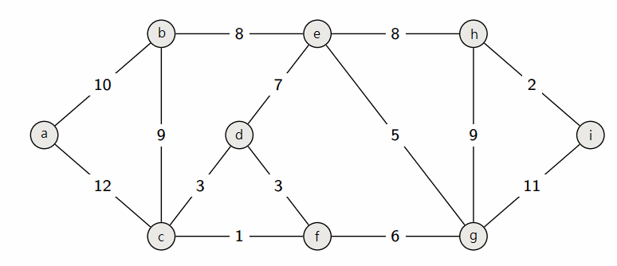
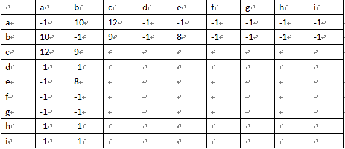
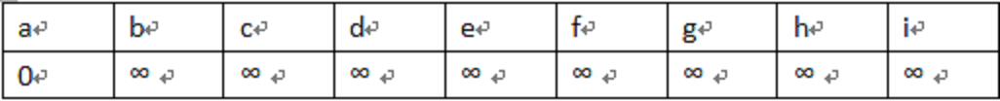
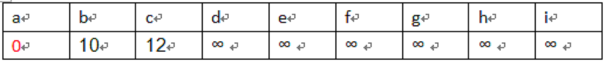
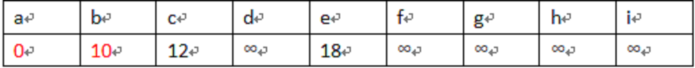

### 競程讀書會Week3
## Dijkstra Algorithm

-----

### Shortest Path 最短路徑

給一張無向圖(有向圖)，求某兩點之間的最短路徑

----

#### 假設要從a走到i，請問最短是多少距離？



-----

## 如何儲存這張圖？

----

### 最常用：鄰接矩陣

(下圖只填a和b)



-----

## Dijkstra Algorithm

準備工作：

宣告一個陣列，目的是儲存當前路徑權重。

將起始點格子設為0，其餘設為無限大。



-----

## Step1

從起始點s開始，遍歷所有與它相連的點v

若d[s]+adj[s][v] < d[v]

則d[v] = d[s]+adj[s][v]

----




-----

## Step2

在尚未使用過的點中(紅色的)找出最小路徑權重的點

並將它重複Step1做的事情

----

b是最小的，因此以它拿來重複Step1




```
d[c] = d[b]+adj[b][c] < d[c] ? d[b]+adj[b][c] : d[c]      //19 > 12   --> d[c] = 12
d[e] = d[b]+adj[b][e] < d[e] ? d[b]+adj[b][e] : d[e]    //18 < ∞     --> d[e] = 18
```

-----

## Step3

重複Step2

直到已將終點作為Step1的起始點就可停止

----

## 示意圖


-----

## 時間複雜度

使用鄰接矩陣時為O(V^2)

V為圖上點的個數

-----

Pseudo Code (不包含初始化)

```
void dijkstra(int s){
	visit[s] = true;	//將s設為已被拜訪
	for(int i=0;i<V;i++){
		if(!visit[i] && adj[s][i] >= 0)	//若i點還沒被拜訪且s和i有連結
			d[i] = adj[s][i] + d[s] < d[i] ? adj[s][i] + d[s] : d[i];
	}
	
	int save=0xffffff,next=-1;
	for(int i=0;i<V;i++){	//尋找最小距離點為下一個起始點
		if(!visit[i] && d[i] < save){	//若i點還沒被拜訪且比save還小
			save = d[i];
			next = i;
		}
	}
	
	if(next != -1){		//若還有點，則以next為起始點再次進行dijkstra
		dijkstra(next);
	}
}
```

-----

## 題目練習

UVA10986、UVA929、2017ITSA桂冠賽闖關組B24

寫完的人可以將程式碼上傳至下面網址供大家參考

檔名統一規定：UVA編號-姓名.cpp

or 2017ITSA桂冠賽闖關組B24-姓名.cpp

Example：UVA583-廖祐德.cpp

https://drive.google.com/drive/folders/1EI2kBxxoYb6VNSm25sIr5SqOuYO-XMKR
