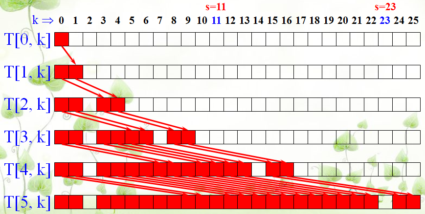

### 競程讀書會Week4
## Dynamic Programming I

-----

### 專門求一個問題的最佳解

Ex: 最大、最小、最長、最短...等

----

### 解這類問題會有幾種方法

1. Dynamic Programming
1. Greedy
1. 暴力法(+剪枝)

-----

### DP的概念

大問題的最佳解是相同子問題的最佳解所組成

類似Divide & Conquer，但將重複算過的值記起來

-----

### 簡單的例子

費氏數列

----

### Divide & Conquer法

```
int fib(int n){
	if(n==0 || n==1){
		retrun 1;
	}
	else{
		return fib(n-1) + fib(n-2);
	}
}
```

----

### DP法
```
fib[0]=1;
fib[1]=1;
for(int i=2;i<n;i++){
	fib[i]=fib[i-1]+fib[i-2];
}
```

----

### DP就這麼簡單？

來看下一個例子

-----

### 例題1

給n個數字，問這些數字是否有幾個數字的總和為s？

Ex：{1,3,5,7,9}, s=13

1+5+7 = 13

1+3+9 = 13

----

### 解法1-暴力法

時間複雜度O(2^n)

----

### 解法2-DP法



----

### 解法2-DP法

時間複雜度O(n*s)

只適合在s小的時候用

-----

### 例題2

將n個數字分成相差最少的兩份，並輸出兩份之間的差值。

n<=100

每個數最大不超過500

----

### 自己想想看怎麼做

-----

### DP是一個很深奧的方法

還有很多例題留到下次講

熟練的話各種比賽想拿獎不是問題

-----

## 題目練習

UVA562、UVA166

寫完的人可以將程式碼上傳至下面網址供大家參考

檔名統一規定：UVA編號-姓名.cpp

Example：UVA562-廖祐德.cpp

https://drive.google.com/drive/folders/1EI2kBxxoYb6VNSm25sIr5SqOuYO-XMKR
